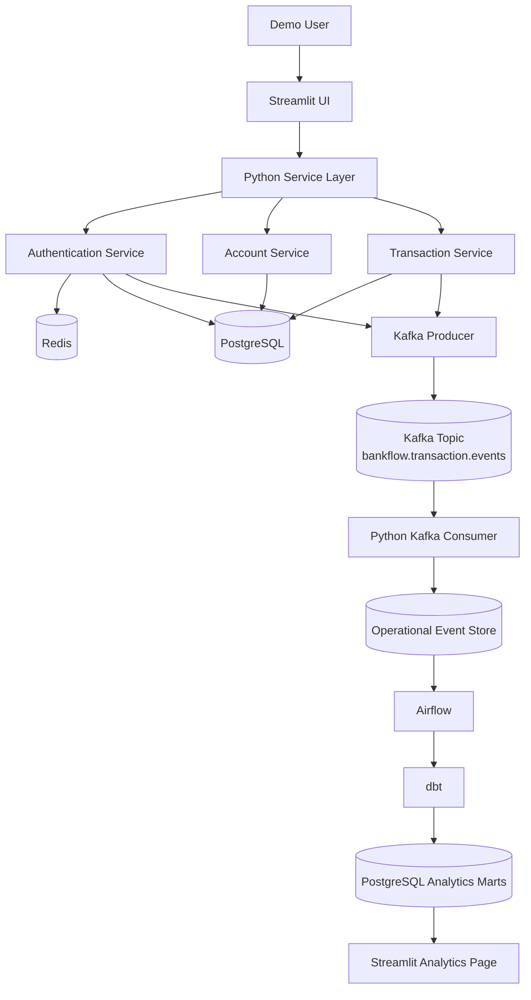
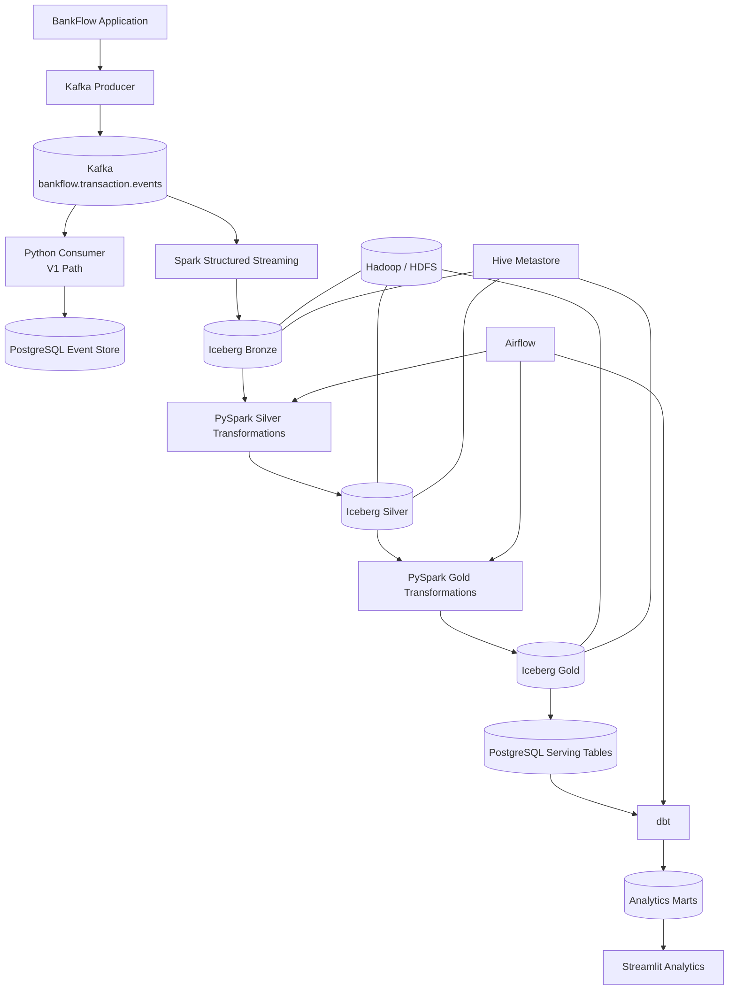
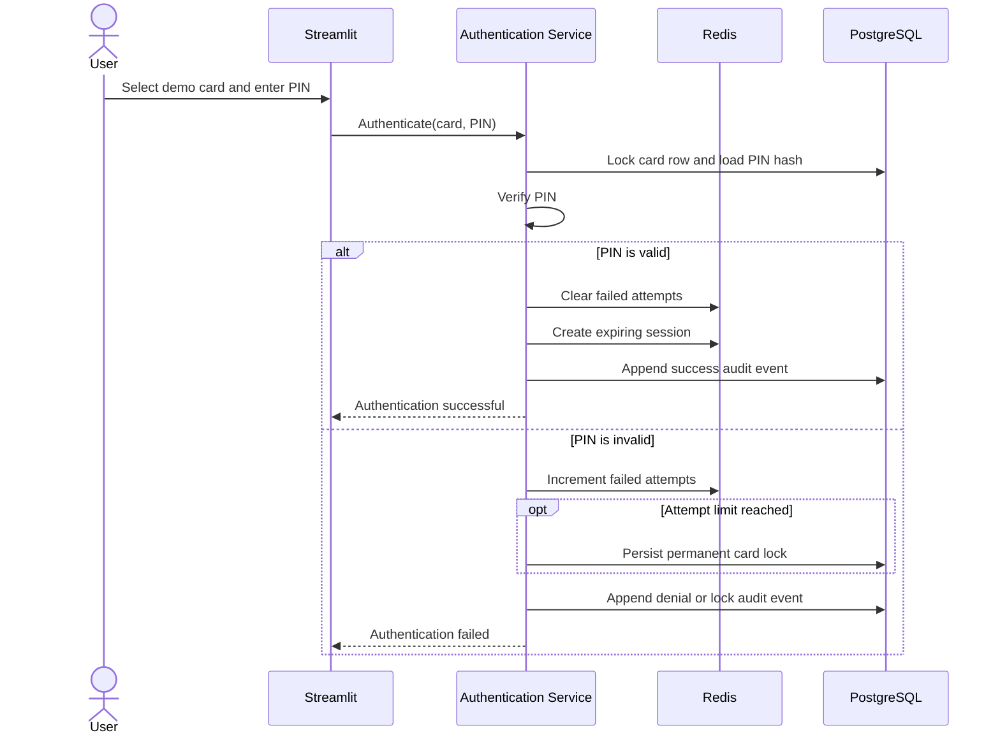
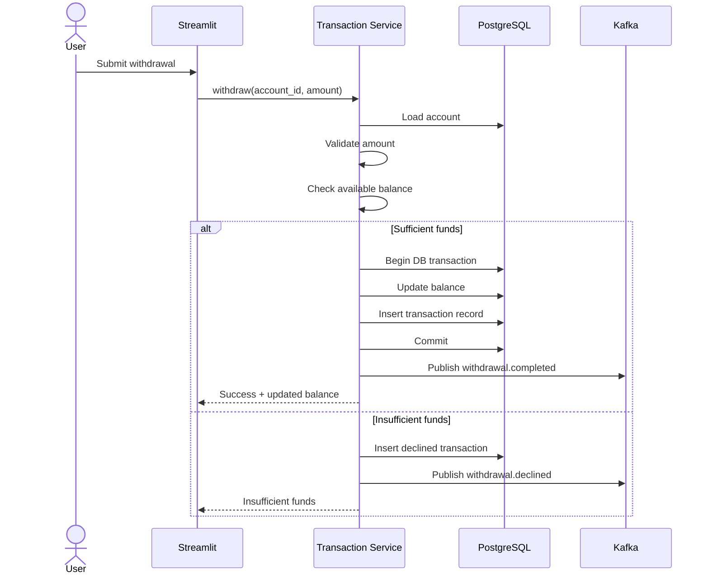

# BankFlow System Architecture

**Project Name:** BankFlow  
**Repository Name:** `BankFlow`  
**Document Type:** System Architecture  
**Planned Releases:** Version 1.0 and Version 2.0  
**Architecture Style:** Modular application + event-driven data platform  

---

## 1. Architecture Overview

BankFlow is designed as a two-stage portfolio project.

- **Version 1.0** focuses on the application platform: ATM workflows, authentication, persistent transactions, event publishing, operational analytics, and a modern Streamlit interface.
- **Version 2.0** extends the project into a scalable data-engineering platform using Spark Structured Streaming, Apache Iceberg, Hadoop/HDFS, Hive Metastore, Airflow, and dbt.

The architecture intentionally separates:

- user interface
- business logic
- transactional persistence
- temporary session state
- event streaming
- analytics processing
- lakehouse processing
- serving and visualization

This separation keeps the project understandable, testable, and extensible.

---

# 2. High-Level Architecture

## 2.1 Version 1.0 — Application and Event Platform



### Version 1 Purpose

Version 1 demonstrates:

- modular Python application design
- Streamlit-based web interaction
- PostgreSQL transaction persistence
- Redis-based temporary authentication/session state
- Kafka event publishing and consumption
- Airflow orchestration
- dbt analytics transformations
- automated testing
- professional project documentation

---

## 2.2 Version 2.0 — Streaming Lakehouse Platform



### Version 2 Purpose

Version 2 demonstrates:

- high-volume event generation
- Kafka-based streaming ingestion
- Spark Structured Streaming
- Bronze / Silver / Gold data architecture
- Apache Iceberg lakehouse tables
- HDFS-backed local storage
- Hive Metastore catalog integration
- Airflow pipeline orchestration
- data-quality validation
- analytics-serving patterns
- portfolio-level data engineering

---

# 3. Architecture Principles

BankFlow follows the following design principles.

## 3.1 Separation of Concerns

The Streamlit layer should handle user interaction only.

Business logic belongs in service classes, database logic belongs in repositories, and infrastructure-specific logic belongs in dedicated database, cache, messaging, or streaming modules.

---

## 3.2 Transactional Source of Truth

PostgreSQL is the authoritative source for:

- customers
- accounts
- cards
- account balances
- transaction records
- persistent account/card state

Redis is never the permanent source of truth for financial balances.

---

## 3.3 Event-Driven Processing

Important application actions generate Kafka events.

Kafka is used to decouple the transactional application from downstream analytics and data-processing systems.

The application should not wait for analytics processing before completing a successful transaction.

---

## 3.4 Temporary State in Redis

Redis is used only for short-lived operational state such as:

- authentication attempt counters
- sessions
- session expiration

Permanent card/account status is persisted to PostgreSQL.

---

## 3.5 Analytics Isolation

Operational transaction workloads and analytical workloads should remain logically separated.

Application transactions write to operational tables.

Analytics pipelines create dedicated serving tables and marts.

---

## 3.6 Configurable Business Rules

Business rules should be configurable whenever practical.

Example:

```python
AUTO_CLOSE_ZERO_BALANCE = True
MAX_PIN_ATTEMPTS = 3
```

The zero-balance account-closing behavior is retained from the original academic project as a configurable demo rule rather than hard-coded production banking behavior.

---

# 4. Technology Stack

## 4.1 Version 1 Technology Stack

| Technology | Role |
|---|---|
| Python | Core application language |
| Streamlit | ATM interface and analytics dashboard |
| Pydantic | Configuration and data validation |
| SQLAlchemy | ORM and database access |
| Alembic | Database schema migrations |
| PostgreSQL | Transactional system of record |
| Redis | Session state and failed PIN counters |
| Apache Kafka | Event streaming backbone |
| `confluent-kafka` | Python Kafka producer/consumer client |
| Airflow | Scheduled workflow orchestration |
| dbt | Analytics transformations and marts |
| pytest | Unit and integration testing |
| Docker | Local runtime environment |
| GitHub Actions | Continuous integration |
| Git / GitHub | Source control and portfolio repository |

---

## 4.2 Version 2 Additional Technology Stack

| Technology | Role |
|---|---|
| Apache Spark | Distributed data processing |
| PySpark | Python interface for Spark |
| Spark Structured Streaming | Kafka streaming ingestion |
| Apache Iceberg | Lakehouse table format |
| Hadoop / HDFS | Local distributed storage |
| Hive Metastore | Iceberg catalog / metadata service |
| Airflow | Lakehouse pipeline orchestration |
| PostgreSQL | Gold-data serving layer |
| dbt | Final analytics marts and business transformations |

---

## 4.3 Existing Development Lab Integration

BankFlow uses services inside the user-created dedicated `bankflow` copy of the Docker-based data lab. Current topology and endpoints are in [ENVIRONMENT.md](ENVIRONMENT.md) and [SERVICES.md](SERVICES.md); see [ADR-002](architecture/ADR-002-dedicated-container.md).

Relevant existing stacks:

```text
stacks/postgres
stacks/redis
stacks/kafka
stacks/airflow
stacks/dbt
stacks/spark
stacks/hadoop
stacks/hive
stacks/lakehouse/iceberg
```

The initial application runs on Windows and connects through the dedicated container's published ports. In-container processing uses internal addresses; do not substitute host ports for internal service ports.

---

# 5. Component Architecture

## 5.1 Streamlit UI

Responsibilities:

- demo card selection
- PIN entry
- account dashboard
- balance display
- withdrawal form
- deposit form
- transaction history
- analytics visualization
- platform status
- demo/project information

The UI must not contain core transaction logic.

---

## 5.2 Authentication Service

Responsibilities:

- validate card
- verify PIN
- track failed attempts
- interact with Redis
- lock card after configured attempt limit
- create authentication events
- manage application session state

---

## 5.3 Account Service

Responsibilities:

- retrieve account information
- retrieve balance
- check account status
- apply configurable account rules
- provide account data to the UI

---

## 5.4 Transaction Service

Responsibilities:

- validate withdrawal/deposit requests
- enforce positive transaction amounts
- enforce sufficient funds
- create transaction IDs
- update balances atomically
- persist transaction history
- publish transaction events

The database transaction should complete before a successful event is published.

---

## 5.5 Repository Layer

Responsibilities:

- isolate SQLAlchemy/database operations
- create/read/update customers
- create/read/update accounts
- manage card records
- persist transactions
- retrieve history
- manage audit-event records

Services should call repositories rather than embedding SQL queries directly.

---

## 5.6 PostgreSQL

### Operational Tables

Expected entities:

```text
customers
accounts
cards
transactions
audit_events
```

### Analytics Serving Tables

Expected Version 1/2 analytics tables:

```text
analytics_daily_transactions
analytics_authentication_metrics
analytics_account_activity
analytics_hourly_volume
```

---

## 5.7 Redis

Expected key patterns:

```text
bankflow:auth:session:<sha256_session_token>
bankflow:auth:attempts:<card_uuid>
```

Example:

```text
bankflow:auth:attempts:33333333-3333-4333-8333-333333333333 = 2
```

Redis data should have appropriate expiration times where applicable.

---

## 5.8 Kafka

Primary topic:

```text
bankflow.transaction.events
```

Initial event types:

```text
authentication.succeeded
authentication.failed
card.locked
balance.viewed
withdrawal.requested
withdrawal.completed
withdrawal.declined
deposit.completed
account.closed
session.ended
```

Sensitive authentication data must never be placed in Kafka messages.

---

# 6. Version 2 Lakehouse Architecture

## 6.1 Bronze Layer

Table:

```text
bronze_bankflow_events
```

Purpose:

- preserve raw event data
- retain event metadata
- provide replayable history
- minimize destructive transformation

Typical fields:

```text
event_id
event_type
event_timestamp
account_id
transaction_id
amount
status
payload
ingestion_timestamp
```

---

## 6.2 Silver Layer

Expected tables:

```text
silver_transactions
silver_authentication_events
silver_account_events
```

Transformations include:

- schema validation
- type standardization
- duplicate removal
- timestamp normalization
- null validation
- invalid-record handling
- transaction reconciliation
- event classification

---

## 6.3 Gold Layer

Expected tables:

```text
gold_daily_transaction_metrics
gold_hourly_transaction_volume
gold_account_activity
gold_authentication_metrics
gold_declined_transactions
```

Example business metrics:

- total transactions
- successful transactions
- declined transactions
- total withdrawal amount
- total deposit amount
- average transaction amount
- failed PIN attempts
- locked cards
- hourly transaction volume
- success rate
- decline rate

---

# 7. Repository / Folder Structure

```text
BankFlow/
│
├── app.py
│
├── pages/
│   ├── 1_Dashboard.py
│   ├── 2_Withdraw.py
│   ├── 3_Deposit.py
│   ├── 4_Transaction_History.py
│   ├── 5_Analytics.py
│   └── 6_Platform_Status.py
│
├── src/bankflow/
│   ├── config/
│   │   ├── settings.py
│   │   └── constants.py
│   │
│   ├── models/
│   │   ├── customer.py
│   │   ├── account.py
│   │   ├── card.py
│   │   ├── transaction.py
│   │   └── audit_event.py
│   │
│   ├── schemas/
│   │   ├── authentication.py
│   │   ├── account.py
│   │   ├── transaction.py
│   │   └── events.py
│   │
│   ├── services/
│   │   ├── auth_service.py
│   │   ├── account_service.py
│   │   └── transaction_service.py
│   │
│   ├── repositories/
│   │   ├── customer_repository.py
│   │   ├── account_repository.py
│   │   ├── card_repository.py
│   │   └── transaction_repository.py
│   │
│   ├── database/
│   │   ├── base.py
│   │   ├── connection.py
│   │   └── session.py
│   │
│   ├── cache/
│   │   └── redis_client.py
│   │
│   ├── messaging/
│   │   ├── producer.py
│   │   ├── consumer.py
│   │   └── event_factory.py
│   │
│   └── utils/
│       ├── validators.py
│       └── identifiers.py
│
├── consumers/
│   └── transaction_consumer.py
│
├── streaming/
│   └── bankflow_stream.py
│
├── spark/
│   ├── bronze/
│   │   └── ingest_events.py
│   │
│   ├── silver/
│   │   ├── transactions.py
│   │   ├── authentication.py
│   │   └── accounts.py
│   │
│   └── gold/
│       ├── daily_metrics.py
│       ├── hourly_metrics.py
│       └── account_metrics.py
│
├── airflow/
│   └── dags/
│       ├── bankflow_daily_analytics.py
│       └── bankflow_lakehouse_pipeline.py
│
├── dbt/
│   ├── dbt_project.yml
│   ├── models/
│   │   ├── staging/
│   │   ├── intermediate/
│   │   └── marts/
│   └── tests/
│
├── migrations/
│
├── scripts/
│   ├── seed_database.py
│   ├── reset_demo.py
│   └── transaction_generator.py
│
├── tests/
│   ├── unit/
│   ├── integration/
│   ├── kafka/
│   ├── spark/
│   └── data_quality/
│
├── docs/
│   ├── PRODUCT_REQUIREMENTS.md
│   ├── ARCHITECTURE.md
│   ├── requirements/
│   ├── architecture/
│   ├── uml/
│   ├── data-model/
│   ├── screenshots/
│   └── original-college-project/
│
├── .github/
│   └── workflows/
│       └── ci.yml
│
├── .env.example
├── .gitignore
├── Dockerfile
├── requirements.txt
├── README.md
├── CHANGELOG.md
└── LICENSE
```

---

# 8. End-to-End Project Flow

## 8.1 User Authentication Flow



Kafka publication is added after the Day 8 event contract and Day 9 producer integration.

---

## 8.2 Withdrawal Flow



---

## 8.3 Version 1 Analytics Flow

```text
Streamlit ATM
      ↓
Python Services
      ↓
PostgreSQL Transaction Commit
      ↓
Kafka Event
      ↓
Python Consumer
      ↓
Operational Event Store
      ↓
Airflow
      ↓
dbt
      ↓
PostgreSQL Analytics Marts
      ↓
Streamlit Analytics Dashboard
```

---

## 8.4 Version 2 Streaming Flow

```text
Application / Synthetic Generator
              ↓
             Kafka
              ↓
    Spark Structured Streaming
              ↓
      Iceberg Bronze Layer
              ↓
       PySpark Validation
              ↓
      Iceberg Silver Layer
              ↓
      PySpark Aggregation
              ↓
       Iceberg Gold Layer
              ↓
 PostgreSQL Analytics Serving
              ↓
             dbt
              ↓
       Business Data Marts
              ↓
       Streamlit Analytics
```

---

# 9. Project Execution Flow

## Phase 1 — Version 1 Application

```text
Project Foundation
        ↓
PostgreSQL Models
        ↓
Authentication + Redis
        ↓
Transaction Engine
        ↓
Streamlit UI
        ↓
Kafka Producer
        ↓
Kafka Consumer
        ↓
Airflow + dbt Analytics
        ↓
Testing + CI
        ↓
BankFlow v1.0
```

---

## Phase 2 — Version 2 Data Platform

```text
Synthetic Transaction Generator
        ↓
Kafka High-Volume Events
        ↓
Spark Structured Streaming
        ↓
Iceberg Bronze
        ↓
Iceberg Silver
        ↓
Iceberg Gold
        ↓
Airflow Orchestration
        ↓
Analytics Serving
        ↓
Streamlit Data Dashboard
        ↓
BankFlow v2.0
```

---

# 10. Service Dependencies

## Version 1 Required Services

```text
PostgreSQL
Redis
Kafka
Python / Streamlit
```

Version 1 analytics additionally requires:

```text
Airflow
dbt
```

---

## Version 2 Additional Services

```text
Spark
Hadoop / HDFS
Hive Metastore
Apache Iceberg
```

---

# 11. Local Runtime Strategy

BankFlow should remain a separate project repository while connecting to the existing Docker-based development lab.

Recommended relationship:

```text
data-engineering-lab/
│
├── stacks/
│   ├── postgres/
│   ├── redis/
│   ├── kafka/
│   ├── airflow/
│   ├── dbt/
│   ├── spark/
│   ├── hadoop/
│   ├── hive/
│   └── lakehouse/iceberg/
│
└── projects/
    └── BankFlow/
```

For a standalone GitHub portfolio repository, BankFlow will contain its own application code and documentation while environment variables point to the dedicated `bankflow` container. The preceding generic folder layout is illustrative; the actual repository is bind-mounted at `/home/datalab/bankflow`.

---

# 12. Configuration Strategy

All environment-specific values should be externalized.

Example `.env.example`:

```text
APP_ENV=development

POSTGRES_HOST=127.0.0.1
POSTGRES_PORT=5433
POSTGRES_DB=bankflow
POSTGRES_USER=bankflow_user
POSTGRES_PASSWORD=

REDIS_HOST=127.0.0.1
REDIS_PORT=6380
REDIS_USERNAME=default
REDIS_PASSWORD=

KAFKA_BOOTSTRAP_SERVERS=127.0.0.1:9093
KAFKA_TRANSACTION_TOPIC=bankflow.transaction.events

MAX_PIN_ATTEMPTS=3
AUTO_CLOSE_ZERO_BALANCE=true
```

Secrets must not be committed to Git.

---

# 13. Architecture Evolution

BankFlow intentionally evolves through clear stages:

```text
Academic ATM Prototype
        ↓
Python Modular Application
        ↓
Streamlit Web Experience
        ↓
PostgreSQL Transaction Platform
        ↓
Redis Session Management
        ↓
Kafka Event-Driven Architecture
        ↓
Airflow + dbt Analytics
        ↓
Spark Structured Streaming
        ↓
Iceberg Lakehouse
        ↓
BankFlow v2.0
```

Each stage introduces a technology only when it has a clear architectural purpose.

---

# 14. Architecture Summary

BankFlow Version 1 demonstrates professional application architecture and event-driven processing.

BankFlow Version 2 extends that architecture into a scalable streaming and lakehouse platform.

The final architecture combines:

```text
Software Engineering
        +
Transactional Systems
        +
Event Streaming
        +
Analytics Engineering
        +
Data Engineering
        +
Lakehouse Architecture
```

The design intentionally avoids unnecessary complexity while providing enough depth to demonstrate application development, system architecture, event processing, data pipelines, testing, and modern data-platform concepts in a single portfolio project.
